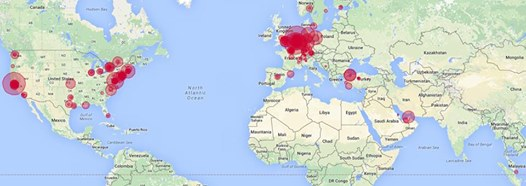
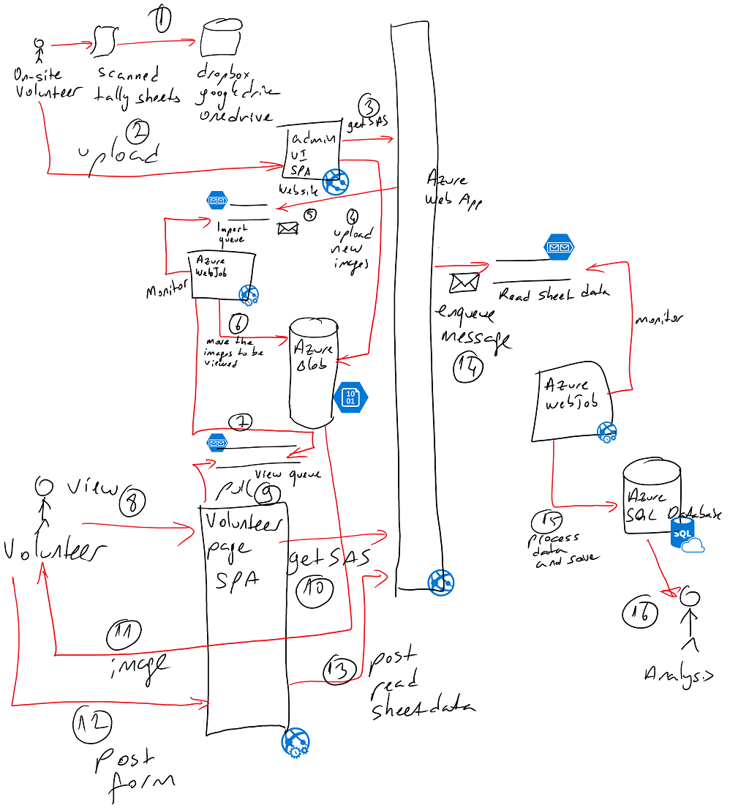

# Toprak
Being a Turkish-American, I had always been interested in helping the people of one of my wonderful countries.

Republic of Turkey had two elections during the recent months (June and November 2015). If anyone asks the reason for two elections in such a short time period, I’d say it is the beyond of the scope of this discussion.

The level of trust towards the state organization conducting those elections, and their approach to tallying the results, at the lightest terms, is minimal. Thus, a number of organizations sprung up to ensure the fairness of the elections during the time.

I got approached by one of those grassroots organizations, which focuses on the votes cast by the Turkish citizens living abroad for coming up with a system that would aid many volunteers to verify the state’s announced election results. Here is how the election process works:

1. Turkish citizens living abroad cast their votes, starting many days before the election day
1. Votes are cast, and stored in large sacks each day at the consulates (54 countries, 113 polling locations), with independent observers in attendance
1. The votes in the sacks are transferred to Turkey prior to the elections, with independent observers present
1. Cast votes are tallied and recorded on the tally sheets, with wet signatures by the observers
1. Tally sheets are entered by the state employees to the nationwide system in the regional centers. This is the weakest link in the chain. We wanted to ensure that 1. the numbers on the tally sheets are entered correctly by the employees. For this, we worked with the major political parties who made hard copies of the tally 1. sheets, and relied on our volunteers to transfer the electronic copies to us

We recruited many volunteers from all around the world. The goal was to use the Turkish people from all around the world as human OCRs (ehem…) to read the hand 
filled forms and correctly enter the recorded results to our system, so we can can compare the results entered by the weakest link (the state employees) with the 
actual tallied numbers.

We also wanted to make sure the same image is read by at least 3 different people with the same data.

The end result was, with the amazing help from our volunteers, we successfully read the wet signature tally sheets and compared them to the state announced results. Numbers were

* 21 countries
* 148 cities
* 353 unique IPs
* 3108 images
* 11,197 impressions for those images
* in 11.5 hours

## Volunteer locations

## High Level Architecture

## How does it work?
Once our volunteers got hold of the copies, they transferred them to us. Here is how the process worked:

1. Volunteers at the political party locations scanned the sheets
1. Volunteers accessed a site that is secured through Facebook authentication (not in the diagram)
1. They uploaded the scanned documents through a SPA hosted on an Azure Web App
    1. The SPA called an API to receive signed access signatures (SAS) for each image to be uploaded
    1. SPA uploaded each image to Azure Blob Store using the SAS
1. Once the upload is complete, SPA notified the API the operation to be completed with the uploaded image URLs
1. API dropped a message to an Azure Queue monitored by an Azure WebJob
1. Azure WebJob moved the image blob to a new container that keeps the images to be viewed
1. API drops messages for each image to be viewed to the Azure queue
1. Volunteers from all around the world, reach the form page
1. Every time one of those comes to the page, the page asks the API which  de-queues a message
1. Generates a read-only SAS token for the image
1. Returns the image URL with the SAS token
1. Volunteer reads the form and submits
1. SPA posts the form data to the API
1. API posts the data contained in the form to a queue
1. A WebJob gets triggered to read the incoming data, processes it so 3+ people read the same image with the same data and saves it to the database
1. At the end, a manual process for analyzing the data is done by another volunteer who has direct access to the database

Please bear in mind that it has a dependency on an earlier prerelase version of ASP.NET.

